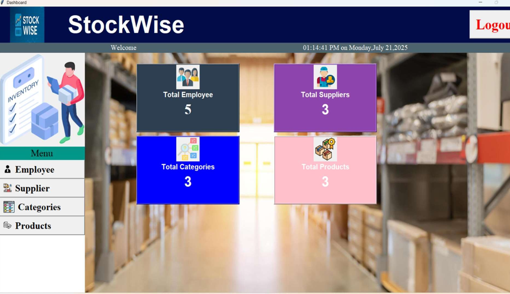
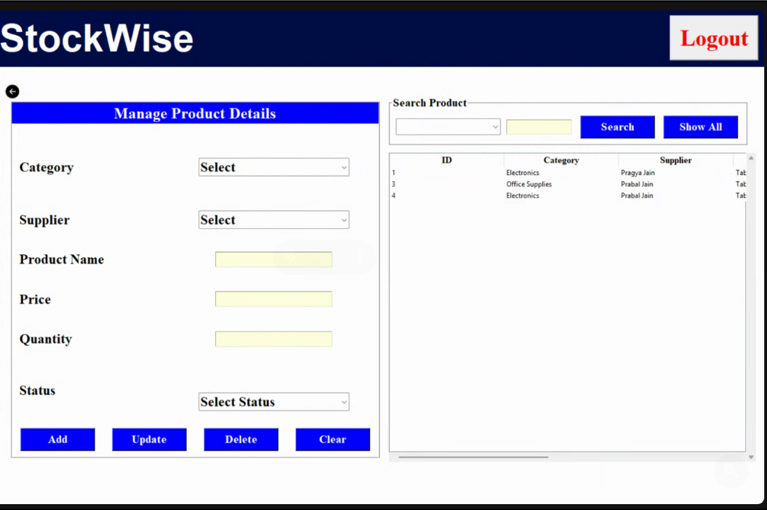
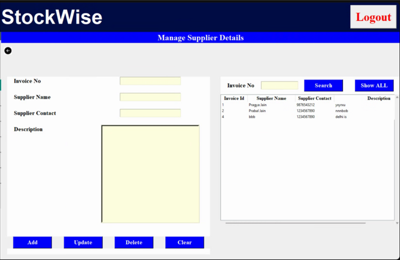
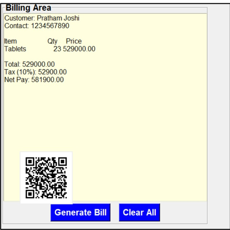

# 📦 Inventory Management System (StockWise)

## 📖 Overview

The Inventory Management System (IMS) is built using **Python (Tkinter)** and **MySQL**.
It allows management of employees, products, categories, and suppliers, along with billing functionality.

---

## 🧠 Key Highlights

* Desktop-based Inventory System using Tkinter
* Full CRUD operations (Employee, Product, Supplier, Category)
* Role-based login system (Admin & Employee)
* Integrated Billing System with QR Code generation
* 🔍 Advanced search functionality across all modules

---

## 🚀 Features

* 🔐 **User Authentication:** Login system for Admin and Employees

* 🛡️ **Role-Based Access:**

  * **Admin:** Full access to manage system
  * **Employee:** Access to billing system

* 📊 **CRUD Operations:**

  * Manage Employees
  * Manage Products
  * Manage Categories
  * Manage Suppliers
  * View Bills / Sales

* 🔍 **Search Functionality:**

  * Search Employees
  * Search Suppliers
  * Search Categories
  * Search Products

---

## 💻 Installation and Setup

### Clone the repository:

```bash
git clone https://github.com/Prabal24/Stockwise-inventory-management-system.git
cd Stockwise-inventory-management-system
```

### Install dependencies:

```bash
pip install pymysql pillow qrcode tkcalendar
```

### Run the project:

```bash
python login.py
```

---

## ⚙️ Usage

### 🔰 First Time Setup

* Create admin user if database is empty
* Login using Employee ID and Password

---

## 🔐 Login System


Handles user login:

* Employee ID
* Password

After login:

* Admin → Dashboard
* Employee → Billing

---

## 📊 Dashboard (Admin Only)



Provides access to:

* Employees
* Suppliers
* Products
* Categories
* Sales Overview

---

## 👨‍💼 Manage Employees


* Add / Update / Delete Employees
* Search Employees
* Manage employee records

---

## 📦 Manage Products



* Add / Update / Delete Products
* Track stock
* Search products

---

## 📂 Manage Categories


* Add / Delete categories
* View category list

---

## 🏢 Manage Suppliers



* Add / Update / Delete suppliers
* Maintain supplier records

---

## 🧾 Billing System (Employee)



* Generate customer bills
* Add products to cart
* Automatic calculations
* QR code generation

---

## 📌 Future Enhancements

* Export reports (PDF/Excel)
* Web-based version (Flask/Django)
* Barcode scanning
* Advanced analytics dashboard

---

## 👨‍💻 Author

**Prabal Jain**

🔗 GitHub: https://github.com/Prabal24

---

## ⭐ Support

If you like this project, please give it a ⭐ on GitHub!
