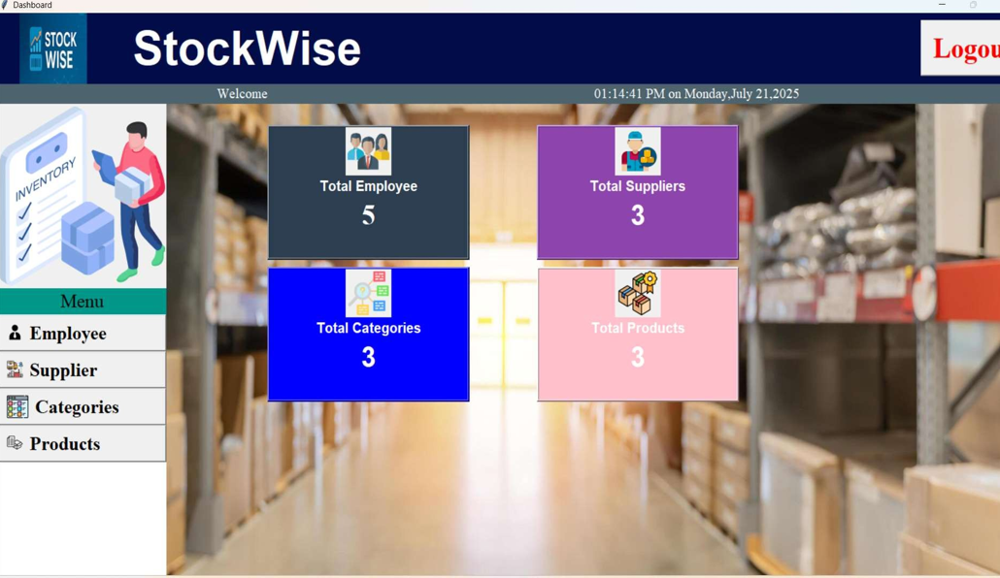
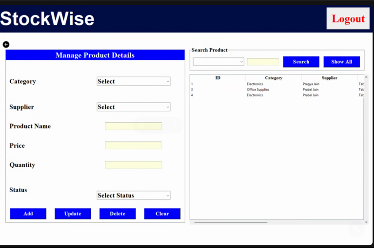
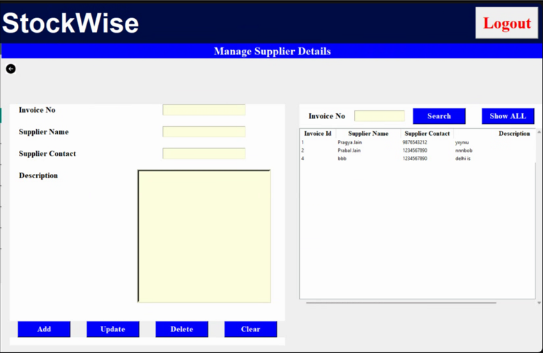
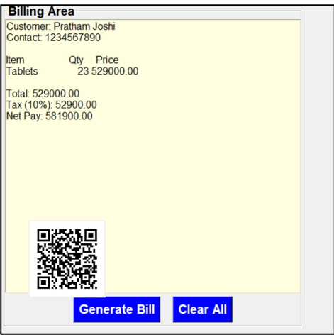

<div align="center">


# 📦 StockWise — Inventory Management System

**A desktop-based Inventory Management System built with Python, Tkinter, and MySQL**


</div>

---

## 📖 Overview

**StockWise** is a full-featured, desktop-based Inventory Management System designed to streamline day-to-day business operations. Built with Python's Tkinter for a responsive GUI and MySQL for reliable data storage, it supports employee management, product tracking, supplier records, and a complete billing workflow — all within a clean, role-based interface.

---

## ✨ Features

| Feature | Description |
|---|---|
| 🔐 **Role-Based Login** | Separate access for Admin and Employee roles |
| 👥 **Employee Management** | Add, update, delete, and search employee records |
| 📦 **Product Management** | Manage stock levels, product details, and categories |
| 🏢 **Supplier Management** | Maintain full supplier records |
| 🗂️ **Category Management** | Organize products into categories |
| 🧾 **Billing System** | Generate bills, manage cart, and produce QR-coded receipts |
| 🔍 **Advanced Search** | Search across all modules instantly |

---

## 🖥️ Screenshots

<table>
  <tr>
    <td align="center"><br/><b>Login Screen</b></td>
    <td align="center"><br/><b>Admin Dashboard</b></td>
  </tr>
  <tr>
    <td align="center"><br/><b>Employee Management</b></td>
    <td align="center"><br/><b>Product Management</b></td>
  </tr>
  <tr>
    <td align="center"><br/><b>Supplier Management</b></td>
    <td align="center"><br/><b>Billing System</b></td>
  </tr>
</table>

---

## 🛠️ Tech Stack

- **Language:** Python 3.x
- **GUI Framework:** Tkinter
- **Database:** MySQL
- **Key Libraries:** `pymysql`, `Pillow`, `qrcode`, `tkcalendar`

---

## 🚀 Getting Started

### Prerequisites

- Python 3.x installed
- MySQL server running locally
- pip package manager

### 1. Clone the Repository

```bash
git clone https://github.com/Prabal24/Stockwise-inventory-management-system.git
cd Stockwise-inventory-management-system
```

### 2. Install Dependencies

```bash
pip install pymysql pillow qrcode tkcalendar
```

### 3. Configure the Database

- Create a MySQL database (e.g., `stockwise_db`)
- Update the database credentials in the relevant Python files (`login.py`, `dashboard.py`, etc.)

```python
# Example config (update in source files)
host = "localhost"
user = "root"
password = "your_password"
database = "stockwise_db"
```

### 4. Run the Application

```bash
python login.py
```

---

## 🔐 Role-Based Access

| Role | Access |
|---|---|
| **Admin** | Dashboard, Employees, Products, Categories, Suppliers, Billing |
| **Employee** | Billing System only |

On first launch, create an Admin account if the database is empty, then log in with your Employee ID and Password.

---

## 📁 Project Structure

```
Stockwise-inventory-management-system/
│
├── login.py          # Entry point — authentication & role routing
├── dashboard.py      # Admin dashboard
├── employees.py      # Employee CRUD module
├── products.py       # Product & stock management
├── category.py       # Category management
├── supplier.py       # Supplier management
├── user.py           # User management
├── try.py            # Billing system
│
├── screenshots/      # App screenshots
├── logo.png          # App logo
└── README.md
```

---

## 🔮 Planned Enhancements

- [ ] PDF & Excel report export
- [ ] Barcode scanning integration
- [ ] Advanced analytics dashboard
- [ ] Web-based version (Flask / Django)
- [ ] Low-stock alerts and notifications

---

## 👨‍💻 Author

**Prabal Jain**

🔗 GitHub: [@Prabal24](https://github.com/Prabal24)
💼 LinkedIn: [prabal-jain-1ba60230a](https://www.linkedin.com/in/prabal-jain-1ba60230a)

---

## ⭐ Support

If you found this project helpful, please consider giving it a ⭐ on GitHub — it means a lot!
